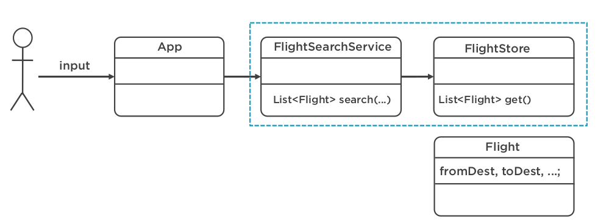

# Course modules:

- Introduction to defensive coding
- [Validating method](https://github.com/HeithemLejmi/DefensiveCoding/tree/main/m3_method_input)
- [Using Framework for Validation](https://github.com/HeithemLejmi/DefensiveCoding/tree/main/m4_using_frameworks)
- [Improve the Method Return Values](https://github.com/HeithemLejmi/DefensiveCoding/tree/main/m5_method_return_values)
- [Other Defensive Practices](https://github.com/HeithemLejmi/DefensiveCoding/tree/main/m6_other_def_practices)

# Project presentation :

- We have a flight reservation page :
  - the required input fields to do the search are:
  - the number of passenger: a number input (we want it to be an integer between 1 and 7)
  - the date of flight: a date input
  - the from and to airport : a string input

# Project architecture :

- We have :
  - the main App: that will accept the inputs and invokes the search
  - the searching is delegated to the FlightSearchService (which require a FlightStore dependency (like a data base of Flights))
  - the FlightStore is acting as a data base which will pull all the Flight Entities from somewhere. On these Flight entities, we will apply the search critirea (provided as inputs)
  

SRP: single responsibility principle (one od the SOLID principles) => every class/method has only one resposibility, and that's why we are separating the searching and retrieving actions.

# Running the program "App" :

- Run the App main class with the arguments : 

  `2 "15-10-2019" "Boston" "New York"`
