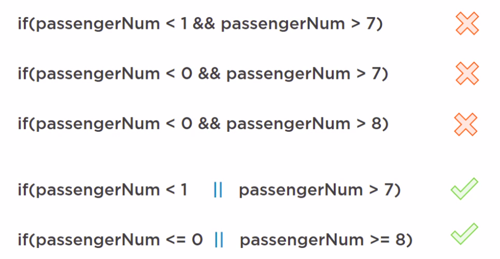

# Module "Validating the method inputs":

Course's slides : [link](https://github.com/HeithemLejmi/DefensiveCoding/blob/main/courses/module3_validating-method-input-slides.pdf)

In this module, we will learn about :
- How to REACT to invalid inputs
- How to PREVENT the propagation of invalid inputs.

Example of good practices, to do this, is: "Guard Clause"
## Guard Clauses : Validating inputs:
**Guard Clause** will helps us to ensure :
- Fail Fast : if invalid input -> then throw an exception
- Return Early  : if invalid input -> then return null or return false or exit the method by doing short `return;`
- Alternative execution: if invalid input -> then execute a different method or print a user-friendly message of what went wrong

*Detecting an issue early, is translated into a faster trouble-shouting later*
  
 


- Four rules while adding a Guard Clause:
1. Avoid deeply nested if else logic because it's very hard to navigate.
2. Avoid throwing at the end of the method. Instead, use a guard clause to validate and stop the execution immediately if something's wrong.
3. Be sure to place that code at the very top before you do anything else (at the very beginning of the method).
4. Balance between being generic and specific


Exercise:
 - Example of a bad practice while using a Guard Clause: where we have multiple nested if statment (and in the deepest 
   layer, we do the searching) and returning null when invalid.
```java
    public List<Flight> search(String fromDest, String toDest, String departDate, int passengerNum){

        // 3. We are doing other actions (retrieving data from DB) before even checking the validity of our method inputs
        List<Flight> flights = flightStore.getFlights();

        // 1. We are doing multiple/nested guard clauses (one could pass, but others could not): we want the check to be 
        done one time for all the inouts:
        if(isInvalidString(fromDest)) {
            throw new IllegalArgumentException("error message");
        }

        if(isInvalidString(toDest) ){
            throw new IllegalArgumentException("error message");
        }

        if(isInvalidString(departDate)){
            throw new IllegalArgumentException("error message");
        }


        // Filter using the criteria: destinations & date & number of seats
        return flights.stream()
                .filter(f -> f.getFromDest().equals(fromDest))
                .filter(f -> f.getToDest().equals(toDest))
                // not null safe - if retrieved date is null
                // then date.equals() will cause a NullPointerException
                .filter(f -> date.equals(LocalDate.parse(f.getDate(), ofPattern("dd-MM-yyyy"))))
                .filter(f -> f.getSeatsAvailable() >= passengerNum)
                .collect(toList());
    }
```

- Correcting the above example:  
  - one if statement to do null-check for all the fields at the same time at the beginning of the method :
    - if null => throw an IllegalArgumentException for the null-check (instead of returning null) (instead of returning null)
    - if not, proceed with the execution
  - this technique is less specific (we don't throw a specific exception for each specific null field, but still we are printing all the field on the exception msg, so we can see the one wh(s causing the problem.
    - If you have many input arguments => go for the generic version
    - if you have few (2 or 3 args), you can try more specific null-check

```java
    public List<Flight> search(String fromDest, String toDest, String departDate, int passengerNum){
  
        if(isInvalidString(fromDest) || isInvalidString(toDest)  || isInvalidString(departDate)) {

            String msg = String.format("You have provided the following arguments, none of them can be null. " +
                    "fromDest: %s, toDest: %s, date: %s", fromDest, toDest, departDate);
            throw new IllegalArgumentException(msg);
        }

         List<Flight> flights = flightStore.getFlights();

        
        // Filter using the criteria: destinations & date & number of seats
        return flights.stream()
                .filter(f -> f.getFromDest().equals(fromDest))
                .filter(f -> f.getToDest().equals(toDest))
                // not null safe - if retrieved date is null
                // then date.equals() will cause a NullPointerException
                .filter(f -> date.equals(LocalDate.parse(f.getDate(), ofPattern("dd-MM-yyyy"))))
                .filter(f -> f.getSeatsAvailable() >= passengerNum)
                .collect(toList());
    }
```

## Crash Course : Explaining Lambdas in java


- To explain `lambda` (or `->`) in java, we will remind ourselves about some math rules that we are going to apply on the 
  block of code below:
    - If we have a given `x` then `->`, if `x < 4` is `true` : collect this `x` to the resulting `list`


```java
// integers example
List<Integer> ints = List.of(2,3,4);

List<Integer> intResult = ints.stream()
      .filter(x -> x < 4) // 2 and 3 passes the criteria, but not 4
      .collect(Collectors.toList());

System.out.println(intResult); // [2, 3]
```

## Number Validation:

- Exercise : for the field `passengerNumber`, we want to allow the user to input a primitive `int` between 1 and 7 
  passengers per reservation => minimum reservation is for 1 passenger, and maximum is for 7. 

  

- Since it is a primitive type (`int`), so we won't have any `null` problem. We only need to check that the 
  `passengerNumber` is between 1 and 7:
   - It is a double check-condition, we should use whether `&&` or `||`.
   - In the screenshot bellow, the three first condition are always false (there is no number that is greater than 7 
     and at the same time less than 1) so it won't work with  `&&`. So we should use 
     the `||`instead !!

  

- This is another rule while validating number:
  - if working on calculation methods, don't forget to add validators to avoid dividing by zer.

## String Validation

- There are two category for String-Validation:
  - Basic validation: to check if a string is `null` or if it is `empty` (after being trimmed).
  - Advanced validation: to check if a string is matching a specific `regex`
  


- Exercise: for the String fields in our App, we don't want this kind of field to be `null` or empty or containing only 
  spaces => Invalid Strings : `null` or `"""` or `"   "`
  - So the check to do in this String-Validation is :
  > destination == null  => to check if the destination field is null or not
  > 
  > destination.trim().isEmpty() => to check if the field destination is empty or not after removing all the spaces

- Remark: The `trim()` method removes whitespace from both ends of a string.
  - example: String str = "  abc   "  => str.trim() = "abc"
  
- We are going to have this double check for each string field, 
  which will lead to a lot of boilerplate code and unreadable code:
  
```java
if ( (fromDest ==  null || fromDest.trim().isEmpty()) 
    || (toDest == null || toDest.trim().isEmpty())  
        || (departDate == null || departDate.trim().isEmpty())) {
  String msg = String.format("You have provided the following arguments, none of them can be null. " +
        "fromDest: %s, toDest: %s, date: %s", fromDest, toDest, departDate);
  throw new IllegalArgumentException(msg);
}
```

- To improve this boilerplate code, we will use the `Decompose or Extract Conditional` strategy: 
  which consist on extracting the check-code and put it in a helper method that do this 
  same check (Nullability && Emptiness) for any String field, and then call this helper method, inside the `if statement`

```java
private boolean isInvalidString(String s){
  // return true if the string is invalid:
  return s == null || s.trim().isEmpty();
}
```

```java
if(isInvalidString(fromDest) || isInvalidString(toDest)  || isInvalidString(departDate)) {

  String msg = String.format("You have provided the following arguments, none of them can be null. " +
        "fromDest: %s, toDest: %s, date: %s", fromDest, toDest, departDate);
  throw new IllegalArgumentException(msg);
}
```

- An example of validation-method applied for email string field (with regex matcher):


- Another important rule while validating/comparing strings :
  - you should respect a specific order while using the `string1.equals(string2)`. The first string here `string1` should 
    not be null:
    
  
## Date Validation :
- The DO and DO_NOT rules while handeling date :


- Explanation:
  - Use the `java.time` dates instead of `java.util.Date`: because the Date Object from the `java.time` are immutable 
    (once created, it can't be changed/edited: it has an immutable state), and Thread-safe. While the older API of `java.
    util.Date` are mutable (their state could be modified after their creation) which is not safe.
    
  - Don't store/handle your DateTime Objects as string. And in case you did, know how to parsing them again from string 
    to DateTime correctly.
    
  - The correct way to convert a string date into a DateTime object is done in two steps:
    - First: Validate that the format is correct (DD/MM/YYYY, etc...)
    - Second: create the DateTime Object using the validated string as parameter 
  - To do the conversion use the `parse(param 1, param 2)` method from the DateTime API, where the `param1` is the string 
    to convert, and the `param2` is the Date formatter to be used for the parsing job. 
    
Here an example of a helper method that we create to validate and parse a **string date input** into **LocalDate Object**, 
and if this string is not valid (there is a `DateTimeParseException` thrown while parsing), the method will throw an
`IllegalArgumentException` :
    
```java
  private LocalDate parseInputDate(String departDate) {
        LocalDate date;

        try {
            date = LocalDate.parse(departDate, ofPattern("dd-MM-yyyy"));
        } catch (DateTimeParseException e){
            String msg = String.format("Could not parse input date '%s', expected format is dd-MM-yyyy", departDate);
            throw new IllegalArgumentException(msg, e);
        }
        return date;
    }
```
- then, of course, this date-validator method will be used to validate the string-date input by the user during the 
  filtering for Flights:


# Specific validations related to th functional context:
- Sometimes, we won't to prevent the user from entering specific values. For example, the user cannot input the same name 
  of country in the field of `fromDestination` and `toDestination` (he cannot travel, from France to France)..
  
- In this case we can add a new validation-check:

```java
if(fromDest.equalsIgnoreCase(toDest)){
  throw new IllegalArgumentException("From and To Destinations cannot be the same. You input " + fromDest);
}
```

- Before, this check you should have already checked that the two string fields `fromDest` and `toDest` :

```java
// Check if all the string inputs ae valid: not null and not empty (after trimming)
if(isInvalidString(fromDest) || isInvalidString(toDest)  || isInvalidString(departDate)) {

  String msg = String.format("You have provided the following arguments, none of them can be null. " +
        "fromDest: %s, toDest: %s, date: %s", fromDest, toDest, departDate);
  throw new IllegalArgumentException(msg);
}

// The fromDest and toDest fields cannot be equals
if(fromDest.equalsIgnoreCase(toDest)){
  throw new IllegalArgumentException("From and To Destinations cannot be the same. You input " + fromDest);
}
```

# Implementing a Class Invariant : a class where all the fields are validated
- A Validator class: is dedicated class where we put all the validation boilerplate there: all the 
  string/date/number/business-logic validators are on the same class, and we can import them and use them later in our 
  FlightSearchService class.
   - There is one drawback here, because we should always remember which validator we should call and at which moment.
   - The best solution, is that the inputs came to the FlightSearchService as already validated data so we no longer need 
     to worry about when and which validation should we use for every input field. To do that, we will create a 
     **[SearchRequest](src/main/java/com/defcoding/entities/SearchRequest.java)** class where we encapsulate all the inputs, along with 
     theirs 
     validators.
     
  - Using this class invariant **SearchRequest** 
     - if the inputs entering this class are invalid: then throw an exception or send an appropriate rejection msg.
     - if data inputs are valid, then construct the object **SearchRequest** and send it further (to the 
       FlightSearchServiceor other Services to instantiate a valid Flight Object)
       
       
  => This way, our system will be sure, that what ever we are recieving (as inputs) will be valid and safe.
- A Class Invariant, is a concept that refers to property that remain true for all instances of a class no matter what 
  happens.
  
- **Conclusion**: Validating in the method (in the `FlightSearchService.search()` for example) is good, but validating in 
  the constructor (if possible) is event better, because it is more guarantee that this created object and all its data 
  are valid and we can use them safely wherever we want without bothering to copy-pasting the validation check in all the 
  methods of our program.
  
