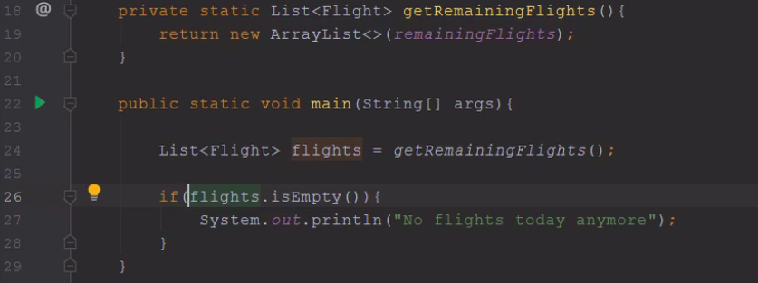

# Module 5 : Improve the Method Return Values

# Introduction:
In this module, we will discuss a variety of method return values :
- Magic Numbers (that we shouldn't return)
- Return Combinations (the combinations that go well together, and the ones that don't)
- Never return Null and what alternatives could replace such return-value

The source of inputs could be :
-  External sources : we may receive the input from UserInterface or a WebServer. 
- Internal sources: We write methods that call each other and pass values to each other within the same program: we may 
  return a bad or unexpected values from one function and then cause a problem in another function. 
  If you return a good value by method the callers of our methods will have cleaner code and lesser bugs.

# Magic Number:
- Avoid writing methods that return magic number (for example a method that return 1 or 0 or -1), 
  because the programmers who are going to call your method ar going to have a hard time to write clean code (you force 
  the programmers to understand the meaning of these magic numbers (1, 0, -1), and to adapt their code to these return values)
  

# Method return options :
Some valid return value are :
- True/False
  - True: returned when success
  - False: returned when failure
- Void/Throw
  - Nothing happen: retrun when success
  - Exception: return when failure 
    (we throw an exception, to let the user know that this void method didn't succeed - See the example of code below)
    

However, the bad return values that we should avoid returning are `null` and also the mixing of `true/false` and `exception`:

In the example below, we have a void method `write`. As we cann see in this screenshot, if the method succeed, nothing 
will be returned, but in case it failed, we should throw an exception to notify the user about its failure:

# Purpose of Null
The `null` is used as :
- value for not initialized fields (necessary) ====> good
- to indicate a missing value or result (not necessary) ======> bad (if the value is missing we should never return null => we could propagate an invalid value inside our program => internal source of invalid input)
  
!! So never return `null` just to indicate the missing values !!
So what are the alternatives of returning `null` when the value is missing :

# Good alternative for Null (to indicate a missing value/result):
There are 4 good alternatives (for null) to indicate that the value is missing :
1) **Throw an exception**

2) **Sensible default** : 
   Sometimes, we invoke an external source to recover some data. if this service is unavailable, 
   what should we do ? throw an exception or do smthg else ?
   Sometimes the absence of data is not necessarily an error,in this case you should ensure the process continuuity and 
   instead of throwing exception you return a back-up value (a default value returned when we have no value)

3) **Empty collection**: 
   When a method, with a returnType as a List, fails, it should not return null, 
   instead send an empty list.
   
Example: if a method with a returnType as a list fails but still return a null, we are forced to check the nullability of 
its result :

After correcting this example, if this method fails it will return an empty list. And we no longer need to check the 
nulability of the result of this method, only the check of the emptiness of this method is required:

4) **Optional<T>**:

- what is an optional ? :  an Optional is a container object which may or may not contain a non-null value.

- why use an optional ? :  Optional has 3 options to deal with the cases wher we have no values:

  - **.orElse()** / **.orElseGet()** => if the optional is empty then return a default value

  - **orElseThrow()** =>  if the optional is empty then throw an exception
  
  - **.ifPresentOrElse(lambdaFunction1, lambdaFunction2)** ==> if the vlue is present then invoke the function in the first 
    arg, else invoke the function in the 2nd arg
  
  !!! Optional.get() is used to unpack the Optional and get the value that it contains, when we are certain that this Optional is not empty. never use it directly unless you are 100% sure that this Optional is packing a value. If the Optional is empty, and still you call Optional.get() you will get a NoSuchElementException  

See the example below for the 3 options of handeling an Optional:

# Conclusion:
After module, we can update our **React & Prevent** table :

