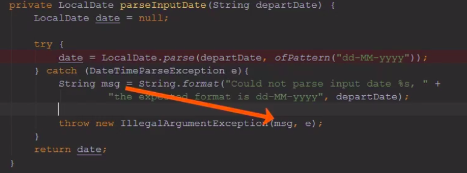

# Module 6 : Other Defensive Practices:

The other practices to follow to write defensive code:
- (Better) Encapsulation: a fundamental building block in object-oriented programming
- Side-effects: and how to avoid them, in certain methods
- Exception handling and anti-patterns
- Static analysis tool (use SonarLint plugin for IntelliJ)

Course slides : [link](https://github.com/HeithemLejmi/DefensiveCoding/blob/main/courses/module6_using-other-defensive-practices-slides.pdf)
# Encapsulation:
- definition: making your fields private and povide pulic getters/setters
  - However, if we are providing public setters ==> it is like we had made these fileds as public
    
==> Correction of the definition: Encapsulation consists on hiding the implementation and the information (by making all the class members inaccessible, by using th accessors level private)
    
- Better encapsulations: 
    - expose public getter/setter as less as possible, and keep the fields private !!
    - don't automatically create getters/setters for all your class's fields: create them only for the fields that you really want to get (or set)
    - expose (public) only the necessary members, of your class => this will prevent the misuse
    

# Side-effects:

There are 2 things that a method can do :
- get/return you a value
- change the state of smthg (and return void)  => Side-effects

Side Effects :
- it happens when a method modifies some state, outside its local scope. 
  Example of side-effects methods:

  
**Command-Query Separation CQS**: Strive to have:
- methods that return a result and do not change the state of the system.
- or methods that change the state of a system but don't return a value.
- never make methods that do both: retrun a value and produce side effects (change a state) at the same time : because this will produces unwanted surprises later on, because we are returning a value and behind the scene changing the state, and when we try to access this state later for some reason or another we will be unpleasantly surprised that the state has changed =====> if you have method that do both getValueAndChangeState(): divide it in two methods : getValue() and changeState() and call each one, only when needed that way we won't have any unexpected surprises.
  ==> This way you will have less surprises, less unexpected behaviour, and thus less bugs:
  
Methods that do both side-effects/return values:

# Improve your exceptions handling:
There are some DO & DO_NOT practice to keep in mind while handling exceptions:

## DO Practice in Exception Handling:
To better handle an exception:
- Pass useful and pertinent information to your exceptions :
  - write a descriptive message to return as the 1st argument the exception to be thrown:
    - pass an informative/descriptive msg of "what went wrong", example : "Could not parse date input"
    - include the input that caused this exception (example "15/10-2019") in the descriptive msg
    - explain what should have been like (to become correct), in the descriptive msg
  
  - and add the root cause (the original exception) as the second argument of the exception that we want to throw
  
Here how it looks :

- Insufficient exception information:

  
- Sufficient exception information:

  
Example of a well handled exception: 
 - we are catching a `DateTimeParseException` as the root cause
 - once caught, we prepare a descriptive message.
 - Then, we pass this descriptive msg as 1st arg & and the root cause as 2nd arg of our `IllegalArgumentException`

## DO NOT Practice in Exception Handling:
- Don't Catch top-level Throwable or the general Exception (with these you will catch out-of-memory error and alike, 
  which are not even meant to be caught or recovereed from) 
  => instead you SHOULD catch lower-level more specific exceptions !! 
  
- Don't catch NPE => instead find the real cause and prevent it from happening and then carry on 
  
- Don't catch and swallow the exception (the do-nothing in the catch blocks)
  => for example, if we do nothing in the catch block of the parseInputDate method we will return null, and this invalid value will propagate in the program causing bugs => better throw an exception in the catch block

# Conclusion:
The react_prevent a diagram after this module:

